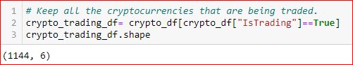
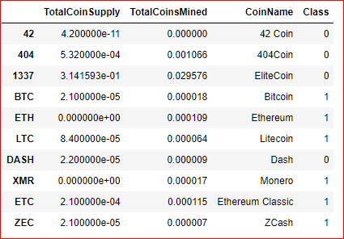

# Cryptocurrencies

## Overview :
Accountability Accounting is interested in offering a new crypocurrency investment portfolio for its customer. We had to create a report that includes what cryptocurrencies are on the trading market and how they could be grouped to create a classification system for this new investment.

### Preprocessing the Data for PCA:
The following five preprocessing steps were performed on the crypto_df DataFrame:
* All cryptocurrencies that were not being traded were removed. 

    

* The IsTrading column was dropped. 

    

* All the rows that have at least one null value were removed. 

    

* All the rows that do not have coins being mined were removed. 

     
    
* The CoinName column was dropped. 

    

* Created CoinName Dataframe:

    

### Reducing Data Dimensions Using PCA:

* Applied PCA to reduce the features to 3 principal components.

* Created DataFrame with column PC 1, PC 2, PC 3 & index from Crypto dataframe.

    

### Clustering Cryptocurrencies Using K-means :

* Created elbow curve to find the best K. 

    

* Used the PCA dataframe to run the K-means algorithm to make the prediction pf the K clusters for the cryptocurrencies' data.

* Created new dataframe by merging the crypto dataframe & pca dataframe. Added the index, CoinName & class to the dataframe. 

    

### Visualizing Cryptocurrencies Results :

* Created 3D scatter plot.

    

* Created a table using hvplot.table() & calculated the total number of rows.

    

* Using MinMaxScaler.fit_transform, created new dataframe.

    

* Created the scatter plot. 

    
    

